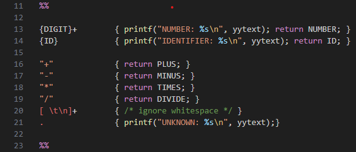
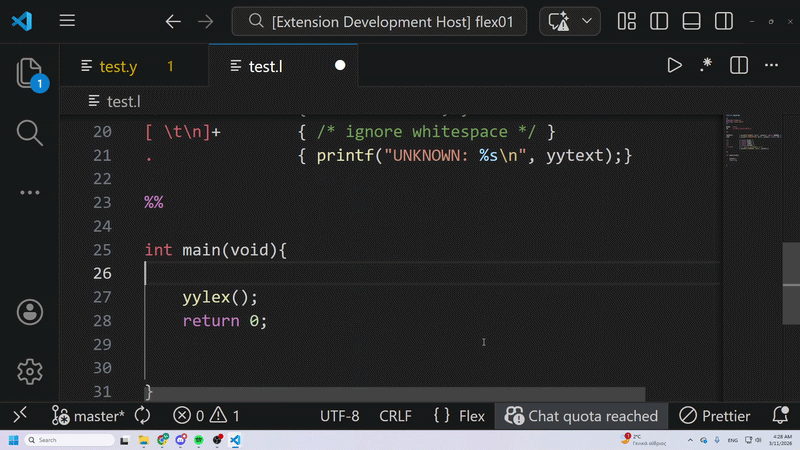
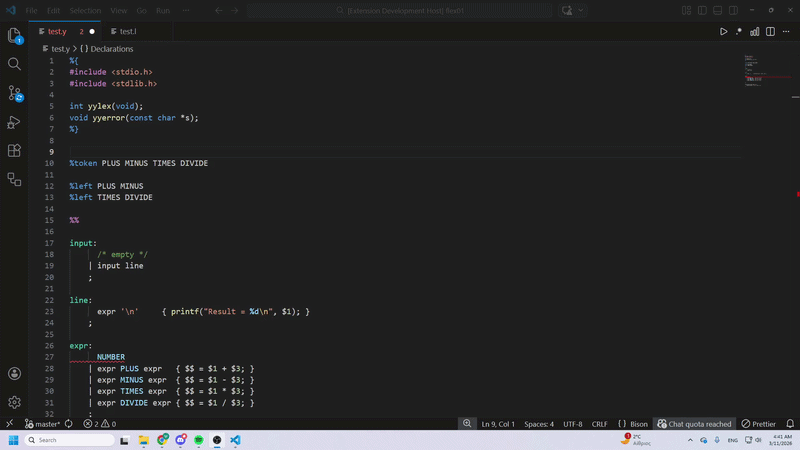
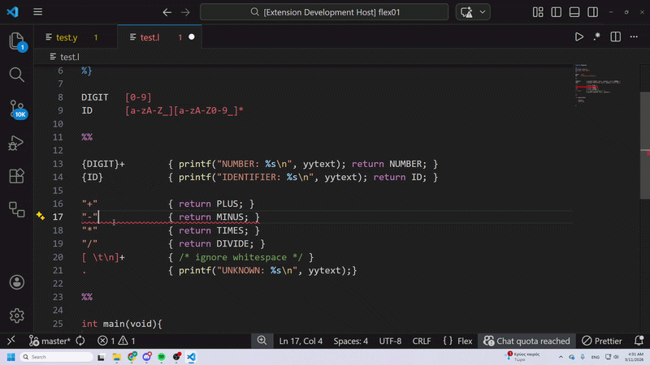
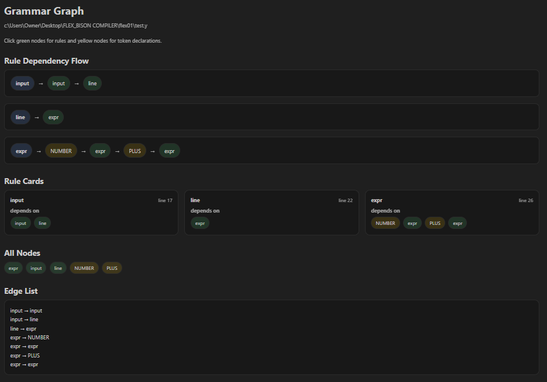
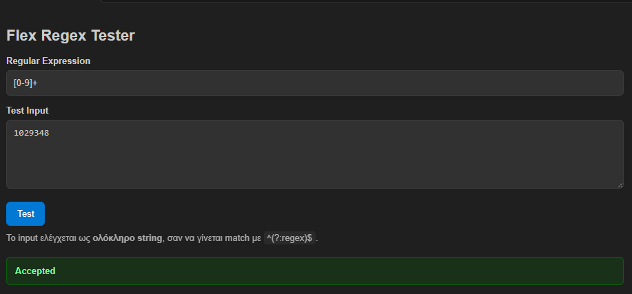
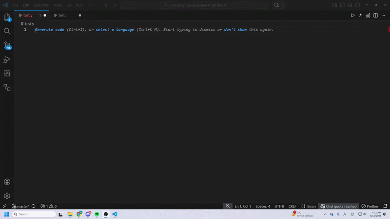
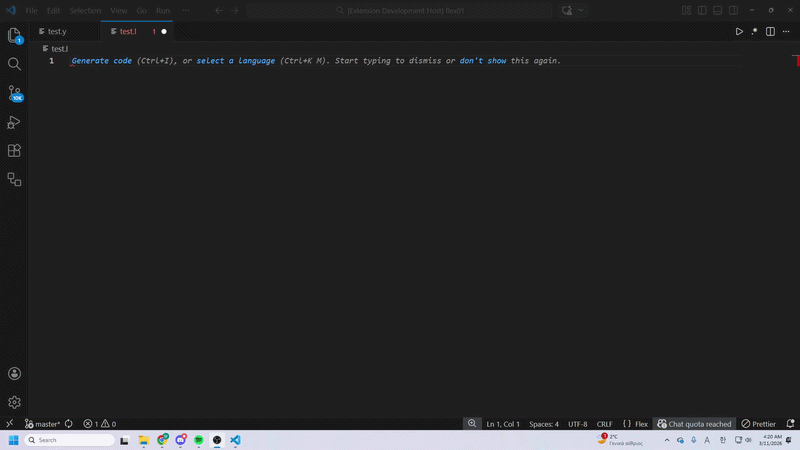

# Flex/Bison VS Code Extension

A Visual Studio Code extension that provides development support for
Flex and Bison files (.l and .y).

The extension adds syntax highlighting, linting, code navigation,
autocomplete, and visualization tools to help users develop lexers
and parsers more efficiently.

## Features

- Syntax highlighting for Flex (.l) and Bison (.y)
- Autocomplete for directives, tokens and grammar rules
- Hover documentation for common Flex/Bison functions and directives
- Go to Definition for tokens and grammar rules
- Find References across Flex and Bison files
- Document outline for grammar sections and rules
- Real-time linting with compiler diagnostics
- Semantic analysis (undefined symbols, duplicate declarations, unused tokens)
- Quick fixes for common issues
- Flex/Bison build command
- Regex tester for Flex regular expressions
- Grammar graph visualization for Bison grammars

- ## Screenshots

### Syntax Highlighting

### Hover Window

### Autocomplete

### Linting and Quick Fix

### Grammar Graph

### Regex Tester

### Bison Auto-build

### Flex Auto-build

## Installation

1. Install Visual Studio Code
2. Install Flex and Bison on your system
3. Clone this repository
4. Run:

npm install
npm run compile

7. Press F5 in VS Code to launch the extension

Or

# VS Code Marketplace

This extension is available on the Visual Studio Code Marketplace.
## Usage

### Build Flex/Bison

Click the **Build Flex/Bison** button in the toolbar or run:

Flex: Run Flex/Bison

from the Command Palette.

---

### Regex Tester

Open the Regex Tester from the command palette:

Flex: Regex Tester

Insert a regular expression and test input to see if it is accepted.

---

### Grammar Graph

Open a Bison (.y) file and run:

Flex: Show Grammar Graph

to visualize grammar rule dependencies.

## Example

Example Bison rule:

expr:
    expr '+' expr
  | NUMBER
  ;

  ## Requirements

- Flex
- Bison
- GCC
- Visual Studio Code

## Author

Marios Georgiou  
Student ID: ics22140  

Department of Applied Informatics  
University of Macedonia, Thessaloniki, Greece  
